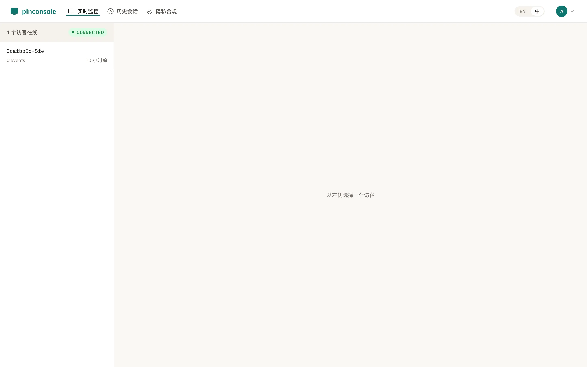
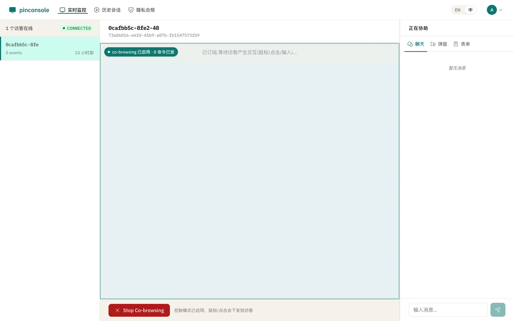
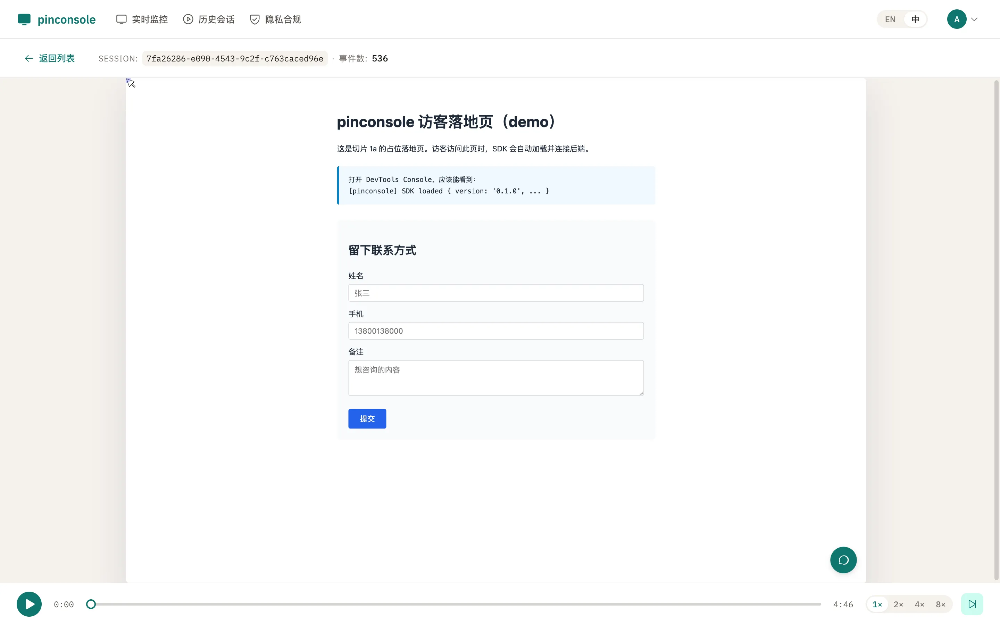
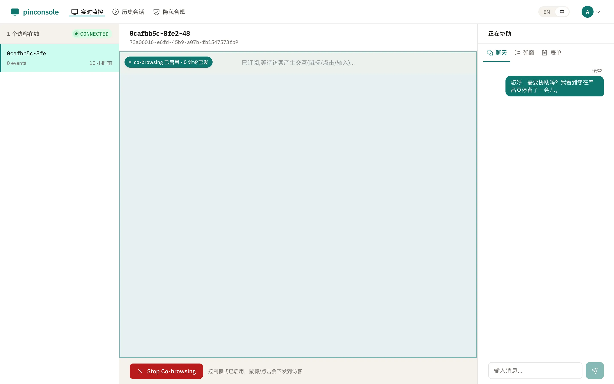
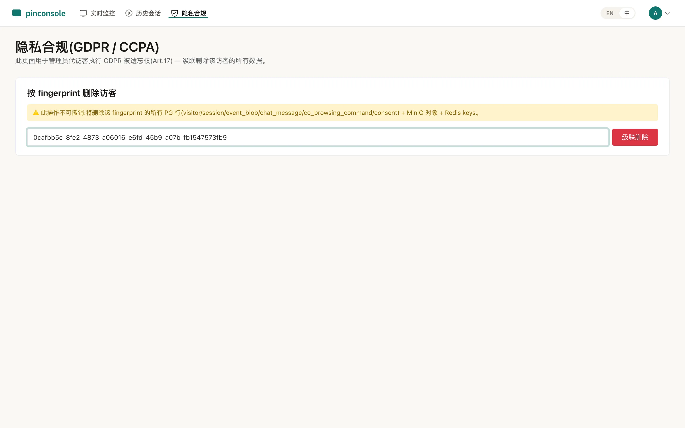
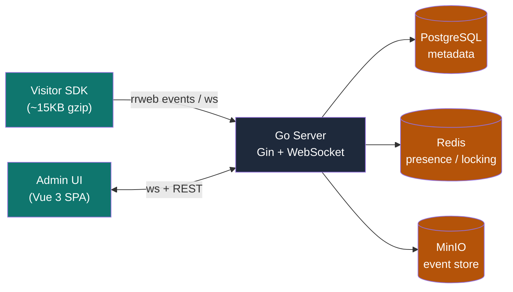

# · pinconsole

> **Your visitors, your data.** · [中文](./README.zh.md) · [Website](https://pinconsole.com) · [Blog](https://pinconsole.com/blog/)

**Open-source self-hosted alternative to FullStory, Hotjar, LogRocket, and Smartlook** — real-time visitor monitoring, co-browsing, and session replay. AGPL-3.0, data never leaves your infra.

[](./LICENSE)
[](./server/go.mod)
[](https://github.com/iannil/pinconsole/actions/workflows/ci.yml)
[](./VERSION)
[](#)
[](./docs/project-status.md)

**Compare with incumbent tools:**

[](https://pinconsole.com/alternatives/fullstory/)
[](https://pinconsole.com/alternatives/hotjar/)
[](https://pinconsole.com/alternatives/logrocket/)
[](https://pinconsole.com/alternatives/smartlook/)
[](https://pinconsole.com/alternatives/cobrowse-io/)

---

## Quick start

```bash
git clone https://github.com/iannil/pinconsole
cd pinconsole
cp .env.example .env

# start infra (PostgreSQL + Redis + MinIO) + build the release binary
make docker-up && make build

# run the server
./server/bin/pinconsole-server
```

- **Visitor landing page:** http://localhost:8080/
- **Admin console:** http://localhost:8080/admin — default `admin@pinconsole.local` (password set via `ADMIN_PASSWORD` env var)

**Production deploy:**

```bash
docker compose --profile prod up -d --build
```

Full Make command list (`make help`), architecture deep-dive, and ops playbook: see [`docs/project-status.md`](./docs/project-status.md) and [`Makefile`](./Makefile).

---

## See it

| Dashboard — real-time monitoring | Co-browsing — operator + visitor |
|---|---|
|  |  |

| Session replay | Live chat + popup |
|---|---|
|  |  |

| Privacy & consent controls |
|---|
|  |

---

## Why this exists

SaaS visitor-engagement tools extract every visitor's behavior, every operator chat, every session recording into their cloud. You pay them to ship your data to their infra — they use it to train their models, lock you in, and price-up next year.

pinconsole exists because **that data is yours**. Run it on your own infra. Audit the code yourself. Leave when you want — your data, schema, and binaries are already in your hands.

**Built as an open-source alternative to:**

| Tool | Why switch |
|---|---|
| [FullStory](https://pinconsole.com/alternatives/fullstory/) | SaaS-only, $599+/month, no co-browsing |
| [Hotjar](https://pinconsole.com/alternatives/hotjar/) | Session caps (35/day free), SaaS-only, no real-time |
| [LogRocket](https://pinconsole.com/alternatives/logrocket/) | Per-session pricing, SaaS-only, no co-browsing |
| [Smartlook](https://pinconsole.com/alternatives/smartlook/) | Session quotas, SaaS-only, no co-browsing |
| [Cobrowse.io](https://pinconsole.com/alternatives/cobrowse-io/) | $30/agent/month, no replay or monitoring included |

---

## Who is this for?

- **Product teams** — session replay without per-session pricing or data leaving your infrastructure
- **Customer support teams** — co-browsing without third-party SaaS subscriptions
- **Compliance-conscious organizations** (GDPR, SOC 2, HIPAA, China PIPL) — data stays in-region or on-premise
- **Developer teams** — open-source, auditable alternative to proprietary session replay tools
- **Chinese market teams** — session replay and co-browsing without cross-border network latency

---

## Features

- **Real-time visitor monitoring** — full rrweb capture (DOM mutations, mouse, scroll, input)
- **Co-browsing** — bidirectional (cursor / click / scroll / form-fill / navigate); rrweb node IDs, no fragile CSS/XPath selectors
- **Session replay** — MinIO archive + rrweb-player; selective screenshots (canvas / WebGL / cross-origin iframe only, 1 fps WebP q70) to keep size sane
- **Live chat + popup** — operator-initiated popups + bidirectional instant chat
- **Multi-operator claim lock** — 1:1 visitor-operator locking (Redis `SET NX` + Lua release)
- **Anti-bot stack** — rate limit + UA blacklist + behavioral analysis + fingerprint (defense in depth)
- **GDPR-compliant** — consent opt-in + right-to-be-forgotten + IP truncation + co-browse consent banner
- **Bilingual i18n** — zh/en from day 1, no hard-coded strings
- **Unlimited session recording** — no session caps, no per-session fees. Your only cost is your own infrastructure.

---

## Architecture



**Hub-and-spoke** — all traffic flows through the central server. Single binary (Go embed), no external CDN, no third-party loaders.

Tech stack: **Go 1.22** · **Vue 3** · **PostgreSQL 16** · **Redis 7** · **MinIO** · **rrweb** · **coder/websocket**

See the blog post: [How We Built a Self-Hosted Session Replay Alternative to FullStory](https://pinconsole.com/blog/building-self-hosted-session-replay/)

---

## Key design decisions

| Principle | Why |
|---|---|
| **Data sovereignty** | Every visitor action, operator chat, and session recording lives in **your** PostgreSQL / Redis / MinIO. No third-party calls, no external dependencies. |
| **AGPL-3.0 strong copyleft** | Every modification must be open-sourced. Cloud vendors cannot take this and re-sell it as SaaS. License-level hard protection. |
| **Standard stack, no lock-in** | Go 1.22 + Vue 3 + PostgreSQL 16 + Redis 7 + MinIO. Industry-standard at every layer. The schema is yours. |
| **~15KB gzip SDK** | Lightweight visitor SDK, served from your own domain. No CDN dependency, no third-party script loaders. |

---

## Known limits (read before production)

1. **Single-instance hub (no horizontal scaling)** — WebSocket routing uses an in-process map (`server/internal/hub/hub.go`). Multi-instance deployment (2+ servers behind a load balancer) silently breaks — visitors and operators on different instances can't see each other. To scale horizontally, introduce Redis Pub/Sub or NATS as the message bus.

2. **500 WS/room concurrency target is not load-tested** — PLAN.md drives single-tenant / hub-and-spoke / 1:1 locking decisions off the "500 WS/room" target, but v1 has not been load-tested. Defaults (`PG_MAX_CONNS=25` / `REDIS_POOL_SIZE=50`) are empirical. Capacity for your workload must be verified by the deployer.

3. **OSS project ships no production topology** — docker-compose `prod` profile is reference only. Real production topology (VM / k8s / reverse proxy / TLS / backup / monitoring / log aggregation / resource limits) is the deployer's call. This repo guarantees only repeatable dev/CI paths, a fail-secure release binary, and `/healthz` + `/readyz` dependency health checks.

4. **Trace_id end-to-end propagation (closed in slice 1z)** — operator browser → server → visitor SDK → server → operator forms a complete trace_id loop: admin SPA injects `X-Trace-Id` on every REST call; visitor SDK caches trace_id on operator command; server `TraceMiddleware` + WS handler restore ctx trace_id.

---

## Roadmap

v1 is shipped. Post-v1, prioritized (see [`PLAN.md`](./PLAN.md) §8 for full backlog):

1. ✅ **Custom domain** — DNS verification + Let's Encrypt ACME + Host-header routing
2. ✅ **Low-code page editor** — drag-drop / JSON schema → Go template render
3. **Tauri desktop client** — Win + Mac, reuses admin SPA
4. **SSO / SAML / OIDC** — enterprise auth

---

## Blog

- [How We Built a Self-Hosted Session Replay Alternative to FullStory](https://pinconsole.com/blog/building-self-hosted-session-replay/) (EN) · [中文](https://pinconsole.com/blog/self-hosted-fullstory-alternative/)
- [AGPL-3.0 vs MIT: Why We Chose AGPL for Our Open Source Project](https://pinconsole.com/blog/agpl-vs-mit/) (EN) · [中文](https://pinconsole.com/blog/agpl-vs-mit-zh/)

---

## Contributing

Contributions are welcome! Here's how to get started:

1. Read [`docs/project-status.md`](./docs/project-status.md) — this file is the single source of truth for project state and architecture.
2. Check open [Issues](https://github.com/iannil/pinconsole/issues) — items tagged `good first issue` are great starting points.
3. Open a [Discussion](https://github.com/iannil/pinconsole/discussions) before starting significant work — we align first, build second.
4. Follow the commit conventions in [`CLAUDE.md`](./CLAUDE.md) — clear, small, single-purpose commits.

**All contributions are assumed to be AGPL-3.0 licensed.** See [`CONTRIBUTING.md`](./CONTRIBUTING.md) (coming soon) for full details.

---

## License

AGPL-3.0 — see [`LICENSE`](./LICENSE).

*Built with Go 1.22 · Vue 3 · PostgreSQL · Redis · MinIO · rrweb.*
