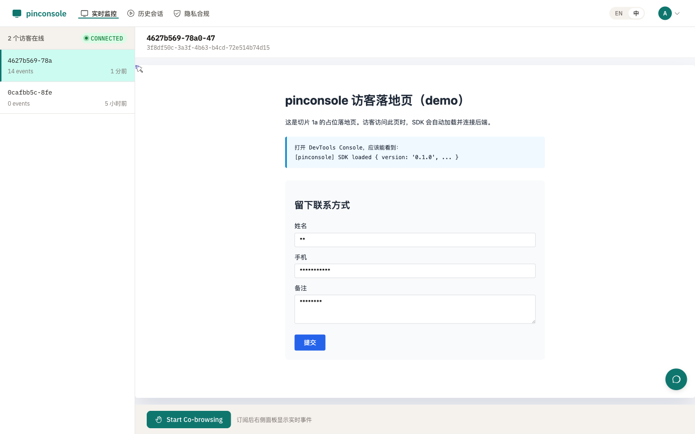
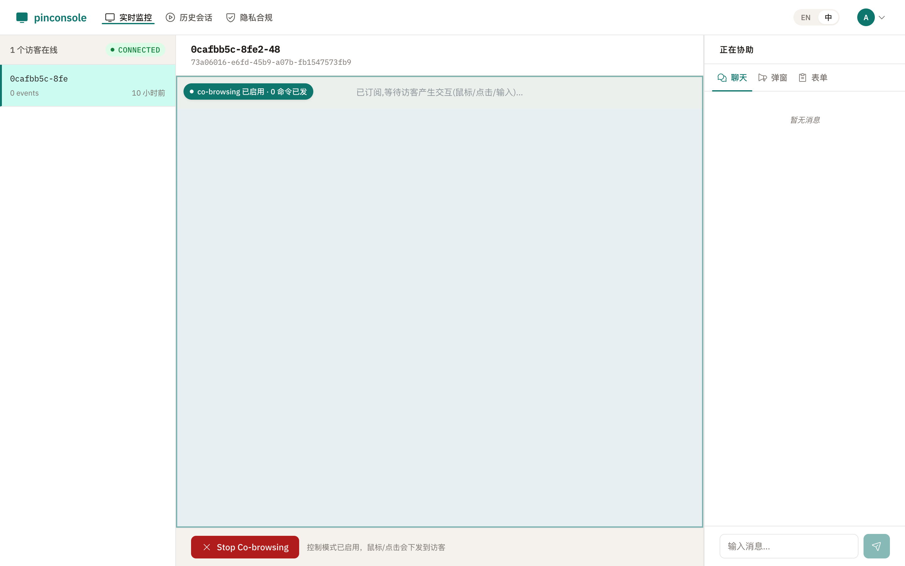

# · pinconsole

> **你的访客，你的数据。** · [English](./README.md)

**FullStory、Hotjar、LogRocket、Smartlook 的开源自托管替代品** —— 实时访客监控、共浏览（co-browsing）、会话回放。AGPL-3.0，数据从不出门。

[](./LICENSE)
[](./docs/reports/completed/2026-06-18-v1-e2e-acceptance.md)
[](./docs/project-status.md)
[](#)

[](https://pinconsole.com/alternatives/fullstory/)
[](https://pinconsole.com/alternatives/hotjar/)
[](https://pinconsole.com/alternatives/logrocket/)
[](https://pinconsole.com/alternatives/smartlook/)

设计决策：

- **数据主权**：所有访客行为、运营对话、录像会话存在**你自己的** PostgreSQL / Redis / MinIO。无第三方调用、无外部依赖。
- **AGPL-3.0 强 copyleft**：任何修改必须开源，**云厂商无法拿去做 SaaS**——license 层的硬保护。
- **标准栈，无锁定**：Go 1.22 + Vue 3 + PostgreSQL 16 + Redis 7 + MinIO。每一层都是行业标准，Schema 在你手里。
- **SDK 仅 ~15KB gzip**——轻量访客 SDK，从你自己的域名提供服务，无需 CDN，无需第三方加载器。

**决策者？** → [pinconsole.com](https://pinconsole.com) · **工程师？** → [自托管](#自托管) · **对比？** → [FullStory](https://pinconsole.com/alternatives/fullstory/) · [Hotjar](https://pinconsole.com/alternatives/hotjar/) · [LogRocket](https://pinconsole.com/alternatives/logrocket/)

---

## 适用人群

- **产品团队**：需要会话回放，但不想按会话量付费或数据离境
- **客服团队**：需要共浏览能力，不想订阅第三方 SaaS
- **合规敏感的组织**（等保、个保法、GDPR）：需要数据境内存储或本地部署
- **开发者团队**：寻找开源、可审计的会话回放工具替代品
- **中国本土团队**：需要流畅的共浏览和会话回放，不受跨国网络延迟影响

---

## 看一眼





---

## 为什么做这个

SaaS 访客互动工具把每个访客的行为、每次运营对话、每段录像都抽到自己的云里。你付费让他们把数据运到他们的基础设施——他们用它训练模型、锁定你、明年再涨价。

pinconsole 存在的理由是：这些数据本来就是你的。跑在你自己的基础设施上，代码你自己审计，想走就走——数据、Schema、二进制本来就在你手里。

**作为以下工具的开源替代品：**

| 工具 | 为什么迁移 |
|---|---|
| [FullStory](https://pinconsole.com/alternatives/fullstory/) | 纯 SaaS，$599+/月，无共浏览 |
| [Hotjar](https://pinconsole.com/alternatives/hotjar/) | 会话上限（免费版 35次/天），纯 SaaS，无实时监控 |
| [LogRocket](https://pinconsole.com/alternatives/logrocket/) | 按会话计价，纯 SaaS，无共浏览 |
| [Smartlook](https://pinconsole.com/alternatives/smartlook/) | 会话配额，纯 SaaS，无共浏览 |

---

## 能力

- **实时访客监控** — rrweb 全量采集（DOM 变更 / 鼠标 / 滚动 / 输入）
- **co-browsing 双向协同** — cursor / click / scroll / 表单代填 / 跳转；用 rrweb 节点 ID，不用易碎的 CSS/XPath 选择器
- **录像回放** — MinIO 归档 + rrweb-player；选择性截图（仅 canvas / WebGL / 跨域 iframe，1fps WebP q70），体积可控
- **弹窗推送 + 双向聊天** — 运营主动弹窗 + 即时聊天
- **多运营 claim 锁** — 1:1 访客-运营锁定（Redis `SET NX` + Lua release）
- **反爬虫栈** — rate limit + UA 黑名单 + 行为分析 + fingerprint（纵深防御）
- **GDPR 合规** — consent opt-in + 被遗忘权 + IP 截断 + co-browse 知情横幅
- **中英双语 i18n** — 从第一天起，无硬编码文案
- **无限会话录制** — 无会话上限，无按会话付费。唯一成本是你的基础设施。

---

## 自托管

```bash
git clone https://github.com/iannil/pinconsole
cd pinconsole
cp .env.example .env

# 启动基础设施 + 构建 release 单二进制
make docker-up && make build

./server/bin/pinconsole-server
```

- 访客落地页：http://localhost:8080/
- 运营后台：http://localhost:8080/admin — 默认 `admin@pinconsole.local`（密码由 `ADMIN_PASSWORD` 环境变量设置）

**生产部署：**

```bash
docker compose --profile prod up -d --build
```

完整 Make 命令清单（`make help`）、架构深度说明、运维手册：见 [`docs/project-status.md`](./docs/project-status.md) 和 [`Makefile`](./Makefile)。

---

## 架构

```
┌─────────────┐     ┌──────────────────┐     ┌──────────────┐
│ 访客 SDK     │────▶│  Go 服务器        │────▶│  PostgreSQL   │
│ (~15KB gzip) │     │  (Gin + WebSocket)│     │  (元数据)     │
└─────────────┘     │                   │     └──────────────┘
                    │  Hub-and-spoke    │     ┌──────────────┐
┌─────────────┐     │  架构             │────▶│  Redis        │
│ 管理后台     │◀───▶│  所有流量经中心    │     │  (在线状态)   │
│ (Vue 3 SPA) │     │  服务器           │     └──────────────┘
└─────────────┘     │                   │     ┌──────────────┐
                    │  单二进制          │────▶│  MinIO        │
                    │  (Go embed)       │     │  (事件存储)   │
                    └──────────────────┘     └──────────────┘
```

技术栈：**Go 1.22** · **Vue 3** · **PostgreSQL 16** · **Redis 7** · **MinIO** · **rrweb** · **coder/websocket**

详见博客：[如何构建一个自托管的 FullStory 替代品](https://pinconsole.com/blog/self-hosted-fullstory-alternative/)

---

## 已知限制（部署前必读）

1. **单实例 hub（不支持横向扩展）**
   WebSocket 路由基于进程内 `map`（`server/internal/hub/hub.go`）。
   多实例部署（2+ server behind LB）会静默失败——访客和运营连到不同实例后互不可见。
   系统不会报错，只是看起来"坏了"。横向扩展需引入 Redis Pub/Sub 或 NATS 作为消息总线。

2. **500 WS/房间并发未压测**
   PLAN.md 把"500 WS/房间"作为设计目标驱动单租户 / hub-and-spoke / 1:1 锁定决策，
   但 v1 **未做实际压测**。默认 `PG_MAX_CONNS=25` / `REDIS_POOL_SIZE=50` 是经验值，
   实际容量需部署方按自己工作负载验证。

3. **OSS 项目不提供生产拓扑**
   docker-compose `prod` profile 仅作为参考。实际生产拓扑
   （VM / k8s / 反代 / TLS / 备份 / 监控 / 日志聚合 / 资源限制）由部署方自行决定。
   本仓库只保证：
   - dev / CI 路径可重复运行
   - release 二进制 fail-secure（默认拒绝弱配置，详见 [`docs/audits/`](./docs/audits/)）
   - `/healthz` + `/readyz` 提供依赖健康检查

4. **Trace_id 端到端传播（1z 已补全）**
   operator browser → server → visitor SDK → server → operator 形成完整 trace_id 闭环：
   - admin SPA 每次 REST 调用注入 `X-Trace-Id` 头（`admin/src/api/client.ts`）
   - visitor SDK 收到 operator command 时缓存 trace_id，后续 10 个事件或 5 秒内继承（`visitor-sdk/src/transport/ws.ts`）
   - server 端 `TraceMiddleware` + WS handler 还原 ctx trace_id

---

## 路线图

v1 已交付。Post-v1 按优先级（完整 backlog 见 [`PLAN.md`](./PLAN.md) §8）：

1. ✅ **自定义域名** — DNS 验证 + Let's Encrypt ACME + Host-header 路由
2. ✅ **低代码页面编辑器** — 拖拽 / JSON schema → Go 模板渲染
3. **Tauri 桌面端** — Win + Mac，复用 admin SPA
4. **SSO / SAML / OIDC** — 企业认证

---

## 博客

- [AGPL-3.0 vs MIT：为什么选择 AGPL](https://pinconsole.com/blog/agpl-vs-mit-zh/)（中文）· [English](https://pinconsole.com/blog/agpl-vs-mit/)
- [如何构建一个自托管的 FullStory 替代品](https://pinconsole.com/blog/self-hosted-fullstory-alternative/)（中文）· [English](https://pinconsole.com/blog/building-self-hosted-session-replay/)

---

## License

AGPL-3.0 —— 详见 [`LICENSE`](./LICENSE)。

*技术栈：Go 1.22 · Vue 3 · PostgreSQL · Redis · MinIO · rrweb。*
